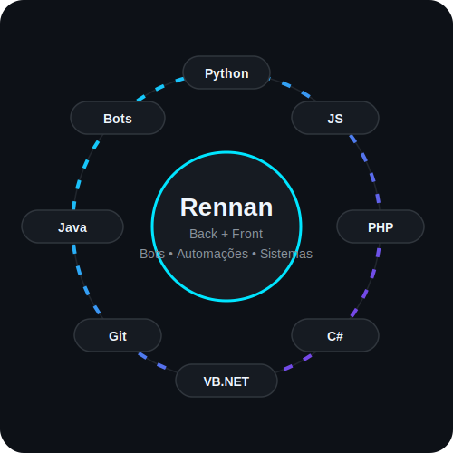

<h1 align="center">Fala, eu sou o Rennan 👨‍💻</h1>

<p align="center">
  
</p>

<p align="center">
  
</p>

<p align="center">
  Transformando ideias em sistemas, bots e automações que resolvem problemas de verdade.
</p>

<p align="center">
  <a href="https://skillicons.dev">
    
  </a>
</p>

---

## ⚡ Sobre mim

```yaml
nome: Rennan
formacao: Estudante de Engenharia de Software
foco: [Back-end, Front-end, Bots, Automações, Sistemas]
stack: [Python, JavaScript, PHP, C#, VB, Git, Java]
status_java: "1% carregado..."
